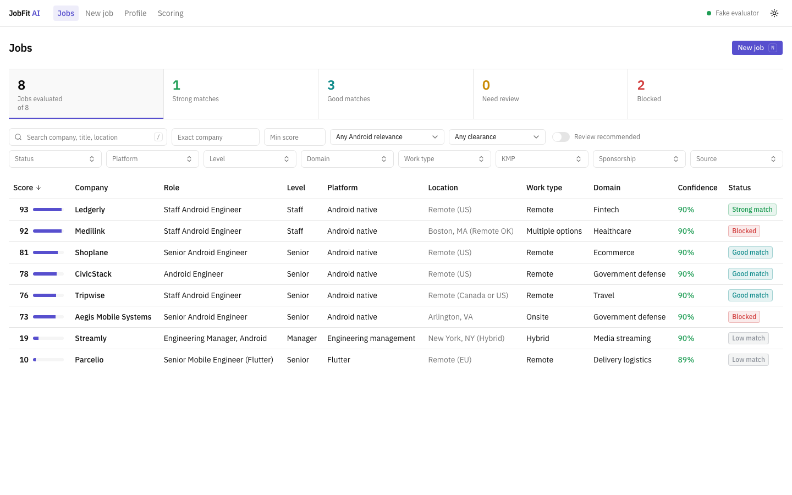
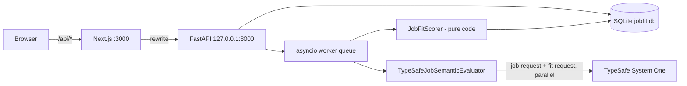
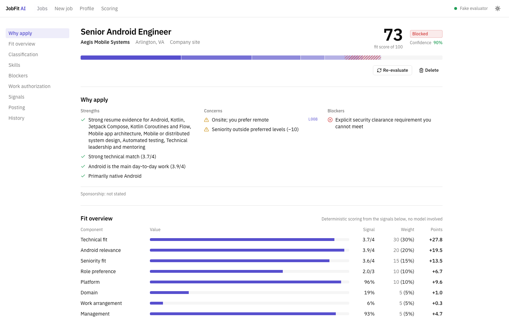
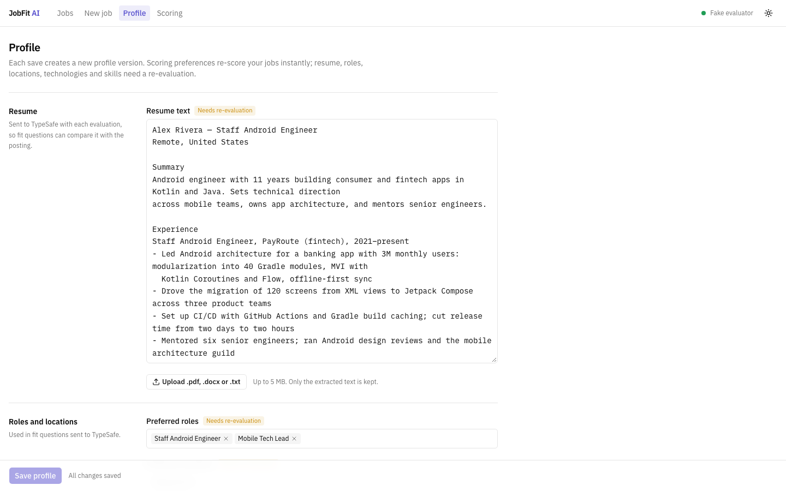

# JobFit AI

JobFit AI is a local, single-user tool for deciding which jobs to apply to. You give it your resume and preferences,
paste a job posting, and it returns a 0–100 fit score, the reasons behind it, missing skills, and any hard blockers
such as a security clearance you can't meet. Every claim links to the posting line it came from.



## Why TypeSafe, and why the score is plain code

Reading a posting takes judgment: is Android the main work or a nice-to-have? Does it actually require a clearance,
or does the employer just sell to government? [TypeSafe System One](https://docs.typesafe.ai) answers questions like
these as **typed** answers. A *Choice* picks one of the options you give it, a *Score* rates on a scale you define,
and a *Noul* gives the probability of yes. Each answer comes with probabilities and, for Choice and Score, a
confidence value. You don't get free text to parse, and no answer can fall outside the options.

The score itself is **never produced by a model**. A deterministic scorer (`backend/app/scoring/`, no I/O, no AI)
combines the signals using weights, penalties, and blocker rules you can inspect and change on the Scoring page.
That split keeps results explainable, reproducible, and cheap to recompute:

- **Re-scoring is free.** Change a weight or a scoring preference and every job is re-scored from stored signals, with
  no API calls.
- **Re-evaluation costs API calls.** Only needed when the posting's meaning must be re-read: a new resume, preferred
  roles or locations, technologies, tracked skills, or a new question catalog version.
- **Fit and confidence stay separate.** Low confidence flags a job for review; it never changes its score or status.



The design spec is [`docs/superpowers/specs/2026-09-17-jobfit-ai-design.md`](docs/superpowers/specs/2026-09-17-jobfit-ai-design.md).

## Setup

Requirements: Python 3.13 with [uv](https://docs.astral.sh/uv/), Node.js ≥ 20.9.

```bash
make setup                        # uv sync + npm ci
cp backend/.env.example backend/.env
```

Pick a model and pin it. `jev-latest` is refused so that results stay reproducible:

```bash
cd backend && TYPESAFE_API_KEY=... uv run python -c "
import asyncio; from typesafe_sdk import AsyncTypeSafeClient
async def main():
    async with AsyncTypeSafeClient() as c:
        for m in (await c.models.list()).models: print(m.name, m.release_date, m.description)
asyncio.run(main())"
```

Set `TYPESAFE_API_KEY` and `TYPESAFE_MODEL` in `backend/.env`, then:

```bash
make dev        # FastAPI on 127.0.0.1:8000 + Next.js on localhost:3000
```

To try it without an API key, set `EVALUATOR=fake` and run `make seed`. That loads a demo profile and eight sample
postings scored from fixtures.

Run a **single uvicorn process**. The evaluation queue lives in memory; unfinished evaluations are re-queued on
startup. Database migrations run automatically on startup (`make migrate` runs them by hand).

### Environment variables (`backend/.env`)

| Variable | Default | Purpose |
|----------|---------|---------|
| `TYPESAFE_API_KEY` | — | Required when `EVALUATOR=typesafe` |
| `TYPESAFE_MODEL` | — | Pinned model name sent with every request |
| `TYPESAFE_MAX_CONCURRENCY` | `4` | Concurrent TypeSafe HTTP requests |
| `TYPESAFE_TOKEN_BUDGET` | `24000` | Estimated tokens per request; questions are packed under it |
| `TYPESAFE_LOG_LEVEL` | `warning` | SDK logger level. `debug` logs full request bodies, including your resume |
| `EVALUATOR` | `typesafe` | `typesafe` or `fake` |
| `EVALUATION_WORKERS` | `4` | Worker tasks |
| `DATABASE_URL` | `sqlite:///./data/jobfit.db` | SQLAlchemy URL |
| `LOG_LEVEL` | `info` | App logger level (JSON lines) |
| `BACKEND_URL` (frontend, server-side) | `http://127.0.0.1:8000` | Where Next.js proxies `/api/*` |

## Adding jobs

Three ways, all on the **New job** page:

- **Paste** — copy the posting text. Always works, and it is the fallback whenever fetching is refused.
- **From URL** — paste a public posting link. Greenhouse, Lever and Ashby URLs use those boards' public APIs, so
  company, title, location and description come back clean. Any other public page is read as text and marked
  "Extracted from the page — check the fields". LinkedIn, Indeed, Glassdoor and ZipRecruiter need a login, so JobFit
  refuses them by name and asks you to paste instead; it never works around a login or a CAPTCHA.
- **From CSV** — upload a spreadsheet with any column names. JobFit guesses which column is company, title,
  description and so on, you confirm or change the mapping, and then import. Up to 500 rows.

Importing never evaluates anything, because each evaluation costs TypeSafe requests. Rows arrive as ordinary jobs you
choose to evaluate, and any row without a usable description is saved as a **draft**: it shows under the Drafts filter,
cannot be evaluated, and lets you paste the missing text on its page. Once a job has been evaluated its posting is
frozen, so quoted evidence lines keep matching the text that was scored.

## How a job is scored

1. **Segment** the posting into numbered lines (`L000`, `L001`, …). Evidence answers are Choices over these IDs, so
   every quote is a verbatim line of the posting.
2. **Ask TypeSafe** two groups of questions in parallel: *job* questions see only the posting; *fit* questions also
   see your resume and preferred roles and locations. Blocker facts, work authorization notes, and scoring-only
   preferences are never sent.
3. **Score** with plain code:

```
base  = 100 × Σ(weight × value) / Σ weight          over components that apply to you
score = clamp(base − penalties, 0, 100)
status = BLOCKED if any hard blocker, else ≥85 STRONG_MATCH, ≥70 GOOD_MATCH, ≥55 REVIEW, else LOW_MATCH
```

| Component | Weight | Value | Skipped when |
|-----------|-------:|-------|--------------|
| Technical fit | 30 | technical_fit / 4 | never |
| Android relevance | 20 | android_relevance / 4 | never |
| Seniority fit | 15 | seniority_fit / 4 | never |
| Role preference | 10 | role_preference_fit / 3 | no preferred roles |
| Platform | 10 | Σ P(role family) × (1 preferred, 0 avoided, 0.5 otherwise) | no platform preferences |
| Domain | 5 | domain_fit / 4, blended 50/50 with P(preferred domain) | never |
| Work arrangement | 5 | Σ P(arrangement) × preference matrix × location factor | remote preference is "any" |
| Management | 5 | from management intensity and your IC / tech lead / manager preference | preference is "any" |

**Penalties** (each at most once): heavy use of an avoided technology (−10), management-heavy role for an IC (−15),
seniority outside preferred levels (−10), required technology not central (−10), missing required skills (−10 per
skill with no resume evidence, −5 if weak, capped at −20).

**Hard blockers** need both an explicit posting signal (probability ≥ 0.80) *and* a matching fact you set in your
profile: clearance, US citizenship, no sponsorship, required relocation, in-office outside your locations, technology
mismatch, seniority far below your level. Probabilities between 0.50 and 0.80 show as "possible blocker — verify".
A posting that says nothing about sponsorship is shown as "not stated", never as sponsorship available.

All weights, thresholds, and penalties are editable on the Scoring page, which saves a new versioned config and
re-scores everything.



## TypeSafe dimensions

| Signal | Primitive | Answer | State |
|--------|-----------|--------|-------|
| `role_family` | Choice | android_native, mobile_general, ios, kotlin_multiplatform, flutter, react_native, backend, fullstack, engineering_management, other | job |
| `android_relevance` | Score | 0–4 | job |
| `seniority` (from scope) | Choice | junior … director_plus, unclear | job |
| `title_level` (from title) | Choice | same as seniority | job |
| `staff_ic_signal` | Noul | P(senior IC with cross-team influence) | job |
| `management_intensity` | Score | 0–4 | job |
| `kmp_requirement` | Choice | required, preferred, mentioned, not_mentioned | job |
| `cross_platform_intensity` | Score | 0–4 | job |
| `domain` | Choice | 15 industry domains | job |
| `work_arrangement` | Choice | remote, hybrid, onsite, multiple_options, unclear | job |
| `requires_relocation` | Noul | P(explicit relocation requirement) | job |
| `security_clearance_required` | Noul | P(explicit clearance requirement) | job |
| `us_citizenship_required` | Noul | P(explicit citizenship requirement) | job |
| `work_authorization_signal` | Choice | explicit_sponsorship_available, explicit_no_sponsorship, explicit_specific_work_authorization_requirement, not_stated, ambiguous | job |
| `min_years_required` | Choice | not_stated, 0–2, 3–4, 5–7, 8–10, 11+ | job |
| `skill_req.<skill>` | Choice | required, preferred, mentioned, not_mentioned — one per tracked skill | job |
| `tech_centrality.<tech>` | Score | 0–3 — one per technology in your lists | job |
| `evidence.<target>` | Choice | a line ID or none — 9 targets (clearance, citizenship, sponsorship, arrangement, relocation, KMP, years, seniority, management) | job |
| `line_kind.<line>` | Choice | required_qualification, preferred_qualification, core_responsibility, other — one per eligible line | job |
| `line_skill.<line>` | Choice | a tracked skill or none — one per eligible line | job |
| `technical_fit` | Score | 0–4 | fit |
| `seniority_fit` | Score | 0–4 | fit |
| `domain_fit` | Score | 0–4 | fit |
| `role_preference_fit` | Score | 0–3, asked only with preferred roles | fit |
| `location_match` | Choice | in_preferred_location, outside_preferred_locations, unclear — asked only with preferred locations | fit |
| `skill_ev.<skill>` | Score | 0–3 resume evidence — one per tracked skill | fit |
| `line_ev.<line>` | Score | 0–3 resume evidence — one per eligible line | fit |

Confidence comes from TypeSafe for Choice and Score. Noul answers have no confidence, so the UI shows a derived value,
|2p − 1|, labeled "derived". Question wording changes bump `EVALUATOR_VERSION`; a test pins the catalog hash for each
version.

## Tests

```bash
make test                          # backend pytest (no network) + frontend tsc, ESLint, next build
make e2e                           # Playwright smoke test of the full flow, fake evaluator
make test-live                     # golden set against recorded TypeSafe responses (skips if none recorded)
make test-live ARGS=--record       # call TypeSafe for real and refresh cassettes (needs key + model)
cd backend && uv run pytest -m live_http   # check the real job boards still return the expected shapes
make screenshots                   # regenerate docs/screenshots
make types                         # regenerate frontend API types from FastAPI's OpenAPI schema
```

The live golden set evaluates eight realistic postings (clearance required, government contractor without a clearance,
silent and explicit sponsorship, Flutter-heavy, engineering manager, Staff title with senior scope, ideal Staff Android)
against a synthetic resume, and checks signal ranges and evidence lines. Recorded cassettes contain only that synthetic
resume. Use these runs to calibrate thresholds before trusting defaults.

## Running this yourself

JobFit is built for one person on one machine. Before you point it at anything shared, note that FastAPI listens on
`127.0.0.1` with **no authentication**, and anyone who can reach that port can read your resume and your saved jobs.
Add authentication before hosting it.

You need your own [TypeSafe](https://typesafe.ai) API key. Evaluating one job costs roughly 150–250 typed questions
across two requests, so a large import can add up; nothing is ever evaluated without you asking.

JobFit is not affiliated with TypeSafe, Greenhouse, Lever, Ashby, or any job board. URL fetching uses those boards'
public APIs and honors `robots.txt`; sites that require a login are refused rather than worked around.

## Privacy

- Everything runs locally. FastAPI listens on `127.0.0.1` with no authentication; add authentication before hosting it
  anywhere.
- Fetching a posting URL only reaches public addresses (never localhost, private ranges, or cloud metadata), honors
  `robots.txt`, follows at most three re-checked redirects, times out after 10 seconds, caps responses at 2 MB, and
  never sends cookies or credentials.
- Your API key stays in `backend/.env`, is held as a secret, and is never logged or sent to the browser.
- Blocker facts and work authorization notes never leave your machine. Resume text and blocker facts are never
  logged.
- `backend/data/` and `.env` are gitignored.

## Roadmap

- **Phase 2:** compare 2–5 jobs side by side and duplicate detection. CSV import and URL fetching are done.
- **Phase 3:** Greenhouse, Lever, Ashby, and Workday providers; recruiter emails from Gmail; a browser extension that
  calls `POST /api/evaluate`; notifications for new strong matches. It will never apply to jobs for you.



## License

MIT — see [LICENSE](LICENSE). Sample postings, the demo resume, and the recorded API fixtures in
`backend/tests/fixtures/` are synthetic; they describe no real person or employer.
