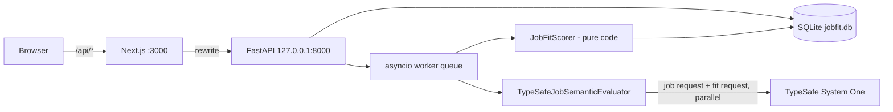

# JobFit AI — Design Spec

- **Date:** 2026-09-17
- **Status:** Approved in brainstorming (sections 1–4); pending written-spec review
- **Source requirements:** user brief "JobFit AI" (§1–§52 referenced below as *brief §N*)

## 1. Summary

JobFit AI is a local, single-user job opportunity evaluator. It compares job postings against
the candidate's resume and preferences and produces explainable, structured fit signals.

```
Resume + preferences + job posting
  → TypeSafe System One (typed semantic signals with probabilities and confidence)
  → deterministic scorer (weights, penalties, hard blockers, thresholds — plain code)
  → persisted, ranked job pipeline (dashboard, detail, history)
```

The final 0–100 score never comes from a model. TypeSafe answers narrow typed questions;
code combines them with transparent, configurable rules.

## 2. Decisions log

| # | Decision | Choice |
|---|----------|--------|
| D1 | Deployment | Local only, single user, no auth. FastAPI bound to `127.0.0.1`. Add auth before any hosting. |
| D2 | Missing-skill extraction | **Option B:** editable tracked-skill list (comparable signals) **plus** per-line JD requirement verification (grounded out-of-list requirements). TypeSafe only; no generative LLM. |
| D3 | Evidence snippets | TypeSafe Choice over tagged JD line IDs + `none` (docs "line-by-line search" pattern). Evidence is always a verbatim JD line. |
| D4 | Request shape | Two states — *job* (posting only) and *fit* (posting + candidate) — each packed into as few requests as the token budget allows, sent in parallel. |
| D5 | Persistence | SQLite via SQLAlchemy 2 + Alembic, portable column types only (PostgreSQL-ready). Rich sub-models stored as JSON. |
| D6 | Execution | In-process asyncio worker queue with a global semaphore; durable status in DB. No Celery/Redis. |
| D7 | Phasing | Phase 1 = MVP (brief §49) + batch endpoint. Compare, duplicates, CSV, URL fetch = Phase 2. Integrations = Phase 3. |
| D8 | `JobContentProvider` | Introduced in Phase 2 with its first real provider. Phase 1 seam is the `ingest` service. |

## 3. TypeSafe facts this design relies on

Verified against live docs (docs.typesafe.ai, 2026-09-17) and the official `typesafe-ai` SKILL.md.

- Endpoint `POST https://api.typesafe.ai/v1/systemone`; Python SDK `typesafe-sdk` (v0.6.0 released 2026-09-15, breaking change from 0.5.7) with `AsyncTypeSafeClient.system_one(state, questions, model=..., retry=..., timeout=...)`.
- Primitives: **Choice** (≤255 options; returns `choice`, `probabilities`, `confidence`), **Score** (2–10 ordered levels; `score` = probability-weighted mean, plus `legend`, `probabilities`, `confidence`), **Noul** (returns only `noul` = P(yes); **no confidence**).
- Questions in one request share one state, are evaluated independently and in parallel; question IDs are not sent to the model.
- Request token budget ≈ 32,000 tokens shared by state + questions.
- `instructions` and criteria accept strings, objects, or arrays; nested state is referenced with backticked paths (`` `job.lines.L017` ``).
- Score levels are judged independently; the model never sees level numbers — levels must describe concrete situations.
- Response exposes `model`, `usage.input_tokens/output_tokens`, `request_id`, `raw_http_response`.
- SDK retries 408/429/5xx by default (`RetryPolicy`, max 2 retries, 30 s budget); default HTTP timeout 10 s.
- SDK `debug` logging prints request/response bodies unredacted → must stay at `warning` or above (resume privacy).

## 4. Architecture

### 4.1 Runtime



- The browser only talks to Next.js; Next.js rewrites `/api/*` to FastAPI (same origin, no CORS).
- `TYPESAFE_API_KEY` lives only in `backend/.env`; never `NEXT_PUBLIC_*`.

### 4.2 Repository layout

```
job_posting_fit_scorer/
  backend/                      FastAPI · uv · Python 3.13 · SQLAlchemy 2 · Alembic · Pydantic v2 · typesafe-sdk==0.6.*
    app/
      main.py                   app factory, lifespan (starts workers, re-queues pending)
      config.py                 pydantic-settings (SecretStr key)
      db.py                     engine (SQLite WAL), session
      models.py                 ORM tables
      domain.py                 Pydantic domain models + enums
      api/                      profile.py · jobs.py · evaluations.py · settings.py · meta.py
      ingest/                   normalize.py (JobPostingIn → JobPosting, content hash)
      semantic/
        evaluator.py            JobSemanticEvaluator Protocol, SemanticJobEvaluation
        lines.py                JD line segmentation
        catalog.py              question builders (static + dynamic), EVALUATOR_VERSION, catalog hash
        state.py                job/fit state builders
        packer.py               token-budget request packing
        parser.py               answers → SemanticJobEvaluation
        typesafe_evaluator.py   ONLY module importing typesafe_sdk
        fake_evaluator.py       fixture-backed evaluator
      scoring/
        config.py               ScoringConfig model + defaults
        components.py · penalties.py · blockers.py · confidence.py
        skills.py               SkillMatch / MissingSkill derivation
        explain.py              explanation rule table
        scorer.py               JobFitScorer
      pipeline/
        worker.py               queue, semaphore, evaluate_job, rescore_all
      logging.py                JSON log formatter
    alembic/
    scripts/seed_demo.py
    tests/                      unit, api, live (golden + cassettes), fixtures
  frontend/                     Next.js App Router · TS strict · Tailwind · shadcn/ui · TanStack Table + Query
  docs/superpowers/{specs,plans}/
  Makefile
  README.md
```

### 4.3 Boundaries

| Unit | Responsibility | Depends on |
|------|----------------|------------|
| `ingest` | Validate/normalize incoming postings, compute content hash, create `JobPosting`. Single seam for all future sources. | domain, db |
| `semantic` | `JobSemanticEvaluator.evaluate(profile, job) -> SemanticJobEvaluation`. | TypeSafe SDK (typesafe impl only) |
| `scoring` | `JobFitScorer.calculate(semantic, profile, config) -> JobFitResult`. Pure, deterministic, no I/O, no AI. | domain |
| `pipeline` | Queueing, bounded concurrency, persistence of evaluations and fit results, re-scoring. | semantic, scoring, db |
| `api` | HTTP surface, request validation, query/filter logic. | pipeline, db |

Only `semantic/typesafe_evaluator.py` imports `typesafe_sdk`.

### 4.4 Versioning and reproducibility

- `EVALUATOR_VERSION` (semver) in `semantic/catalog.py`; bumped whenever state format, segmentation, question wording, or parsing changes.
- `catalog_hash`: sha256 of the static question templates + segmentation version. A unit test pins the hash per `EVALUATOR_VERSION`, so changing a question without bumping the version fails CI.
- `question_set_hash`: sha256 of the exact questions sent for one evaluation (includes per-line questions); stored per evaluation; used by the debug rebuild endpoint.
- `TYPESAFE_MODEL` is pinned in env (not `jev-latest`); the `model` returned by the API is stored.
- Profile edits create immutable **profile versions**; evaluations reference the version used.
- Scoring config is versioned; re-scoring creates new fit-result rows (history retained).

## 5. Domain model

### 5.1 Enums

```python
RoleFamily = Literal["android_native", "mobile_general", "ios", "kotlin_multiplatform", "flutter",
                     "react_native", "backend", "fullstack", "engineering_management", "other"]
Seniority  = Literal["junior", "mid", "senior", "staff", "principal", "architect", "manager",
                     "senior_manager", "director_plus", "unclear"]
Domain     = Literal["fintech", "healthcare", "ecommerce", "marketplace", "social", "media_streaming",
                     "automotive", "ai_ml", "enterprise", "developer_tools", "travel",
                     "delivery_logistics", "gaming", "government_defense", "other"]
WorkArrangement   = Literal["remote", "hybrid", "onsite", "multiple_options", "unclear"]
RequirementLevel  = Literal["required", "preferred", "mentioned", "not_mentioned"]
WorkAuthSignal    = Literal["explicit_sponsorship_available", "explicit_no_sponsorship",
                            "explicit_specific_work_authorization_requirement", "not_stated", "ambiguous"]
YearsBucket       = Literal["not_stated", "y0_2", "y3_4", "y5_7", "y8_10", "y11_plus"]
LineKind          = Literal["required_qualification", "preferred_qualification", "core_responsibility", "other"]
LocationMatch     = Literal["in_preferred_location", "outside_preferred_locations", "unclear"]
FitStatus         = Literal["STRONG_MATCH", "GOOD_MATCH", "REVIEW", "LOW_MATCH", "BLOCKED"]
EvaluationStatus  = Literal["pending", "running", "succeeded", "failed"]
JobSource         = Literal["linkedin", "indeed", "company_site", "recruiter_email", "manual", "other"]
```

### 5.2 Candidate profile

```python
class CandidatePreferences(BaseModel):
    # semantic fields — feed TypeSafe questions; changing them requires re-evaluation
    preferred_roles: list[str] = []
    preferred_locations: list[str] = []
    required_technologies: list[str] = []
    preferred_technologies: list[str] = []
    avoid_technologies: list[str] = []
    # scoring-only fields — changing them re-scores instantly
    preferred_levels: list[Seniority] = []
    preferred_role_families: list[RoleFamily] = []   # brief's "preferredPlatforms"
    avoided_role_families: list[RoleFamily] = []
    preferred_domains: list[Domain] = []
    remote_preference: Literal["remote", "hybrid", "onsite", "any"] = "any"
    willing_to_relocate: bool = False
    management_preference: Literal["ic", "tech_lead", "manager", "any"] = "any"
    years_experience: float | None = None
    # display only — never used by logic, never sent to TypeSafe
    work_authorization_notes: str | None = None

class BlockerFacts(BaseModel):          # local only; never sent to TypeSafe; never logged
    needs_visa_sponsorship: bool | None = None
    can_meet_us_citizenship_requirement: bool | None = None
    can_meet_clearance_requirement: bool | None = None

class TrackedSkill(BaseModel):          # semantic
    id: str                              # slug, e.g. "jetpack_compose"
    label: str
    description: str = ""

class CandidateProfile(BaseModel):      # one immutable version
    id: UUID
    created_at: datetime
    resume_text: str                     # semantic
    preferences: CandidatePreferences
    blocker_facts: BlockerFacts
    tracked_skills: list[TrackedSkill]   # default list in §6.8
    semantic_hash: str                   # sha256 of resume_text + semantic preference fields + tracked_skills
```

No preference values are hardcoded; defaults are empty/`any` except the seeded tracked-skill list.

Validation: a technology (compared case-insensitively after trimming) may appear in only one of the required/preferred/avoid lists; a role family may not be both preferred and avoided; tracked skill IDs are unique slugs (`^[a-z][a-z0-9_]*$`); `resume_text` is non-empty.

### 5.3 Job posting

```python
class JobPostingIn(BaseModel):
    company: str                      # required, trimmed, 1–200 chars
    title: str                        # required, trimmed, 1–200 chars
    description: str                  # required, ≥ 50 chars
    location: str | None = None
    source: JobSource = "manual"
    source_url: HttpUrl | None = None # http/https only
    salary_text: str | None = None
    external_id: str | None = None

class JobPosting(JobPostingIn):
    id: UUID
    content_hash: str                 # sha256(lower(collapse_ws(company|title|description)))
    created_at: datetime
    imported_at: datetime
```

Postings are immutable after creation (evidence line IDs must stay valid). Editing = create a new job.

### 5.4 Semantic evaluation

```python
class ChoiceSignal(BaseModel):
    value: str
    probabilities: dict[str, float]
    confidence: float

class ScoreSignal(BaseModel):
    score: float
    levels: int
    normalized: float                 # score / (levels - 1)
    probabilities: dict[int, float]
    confidence: float

class NoulSignal(BaseModel):
    probability: float
    derived_confidence: float         # |2p - 1|, labeled "derived" in UI

class Evidence(BaseModel):
    line_id: str | None               # None when the model picked "none"
    text: str | None
    probability: float                # probability of the selected option

class SkillSignal(BaseModel):
    requirement: ChoiceSignal         # RequirementLevel
    evidence: ScoreSignal             # 4 levels

class RequirementLine(BaseModel):
    id: str                           # "L017"
    text: str
    kind: ChoiceSignal                # LineKind
    skill: ChoiceSignal               # tracked skill id or "none"
    evidence: ScoreSignal             # 4 levels

class RequestMeta(BaseModel):
    request_id: str | None
    state_kind: Literal["job", "fit"]
    question_count: int
    input_tokens: int | None
    output_tokens: int | None
    latency_ms: int
    raw_response: dict

class SemanticJobEvaluation(BaseModel):
    # job-intrinsic
    role_family: ChoiceSignal
    android_relevance: ScoreSignal
    seniority: ChoiceSignal
    title_level: ChoiceSignal
    staff_ic_signal: NoulSignal
    management_intensity: ScoreSignal
    kmp_requirement: ChoiceSignal
    cross_platform_intensity: ScoreSignal
    domain: ChoiceSignal
    work_arrangement: ChoiceSignal
    requires_relocation: NoulSignal
    security_clearance_required: NoulSignal
    us_citizenship_required: NoulSignal
    work_authorization_signal: ChoiceSignal
    min_years_required: ChoiceSignal
    # candidate fit (None when the question was skipped because its preference is unset)
    technical_fit: ScoreSignal
    seniority_fit: ScoreSignal
    domain_fit: ScoreSignal
    role_preference_fit: ScoreSignal | None
    location_match: ChoiceSignal | None
    # dynamic
    skills: dict[str, SkillSignal]            # by tracked skill id
    technologies: dict[str, ScoreSignal]      # by technology slug (centrality)
    lines: list[RequirementLine]              # eligible lines only
    all_lines: dict[str, str]                 # full line map, L000…
    evidence: dict[str, Evidence]             # by target signal name
    # meta
    model: str
    evaluator_version: str
    catalog_hash: str
    question_set_hash: str
    requests: list[RequestMeta]
```

### 5.5 Fit result

```python
class ComponentResult(BaseModel):
    name: str                         # technical, android, seniority, role_preference, platform, domain, work_arrangement, management
    applicable: bool
    value: float | None               # 0–1
    weight: float                     # configured weight
    effective_weight: float           # after renormalization (0 when n/a)
    contribution: float               # points toward base score
    confidence: float | None
    reason: str | None                # e.g. "n/a: no role-family preferences set"

class Penalty(BaseModel):
    type: str
    points: float
    reason: str
    signal_ids: list[str]

class HardBlocker(BaseModel):         # brief §23
    type: str
    reason: str
    confidence: float                 # probability of the triggering signal
    evidence: str | None

class SkillMatch(BaseModel):          # brief §21
    skill: str
    requirement_level: Literal["required", "preferred", "mentioned"]
    candidate_match: float            # normalized evidence 0–1
    confidence: float                 # min(requirement.confidence, evidence.confidence)
    evidence_line_ids: list[str]

class MissingSkill(BaseModel):        # brief §22
    skill: str                        # tracked label, or verbatim JD line
    source: Literal["tracked_skill", "requirement_line"]
    importance: Literal["critical", "important", "nice_to_have"]
    candidate_evidence: Literal["none", "weak", "partial"]
    impact: Literal["blocker", "significant", "minor"]   # "blocker" is never produced (see §7.8)
    line_ids: list[str]

class Explanation(BaseModel):
    section: Literal["strength", "concern", "uncertain", "note"]
    text: str
    signal_ids: list[str]
    confidence: float | None
    evidence_line_id: str | None

class JobFitResult(BaseModel):
    overall_score: float              # 0–100 after penalties
    base_score: float
    status: FitStatus
    aggregate_confidence: float
    needs_review: bool
    stale_semantics: bool             # profile semantic_hash differs from the evaluation's profile version
    components: list[ComponentResult]
    penalties: list[Penalty]
    hard_blockers: list[HardBlocker]
    possible_blockers: list[HardBlocker]
    skill_matches: list[SkillMatch]
    missing_skills: list[MissingSkill]
    explanations: list[Explanation]
    uncertain_signals: list[str]
```

## 6. TypeSafe semantic layer

### 6.1 Line segmentation (`semantic/lines.py`)

1. Normalize line endings; trim; collapse internal whitespace.
2. Split on newlines; drop empty lines.
3. Strip bullet markers (`-`, `*`, `•`, `–`, `1.`, `1)`).
4. Split lines longer than 300 characters on sentence boundaries `(?<=[.!?])\s+(?=[A-Z0-9])`.
5. While more than 254 lines remain, merge the shortest adjacent pair.
6. Assign IDs `L000`… in order.

**Eligible lines** (get per-line questions): length ≥ 20 characters and not ending with `:`.
Header lines remain in state for context.

### 6.2 States (`semantic/state.py`)

```jsonc
// job state — used by all job-intrinsic questions
{
  "job": {
    "title": "Staff Android Engineer",
    "company": "Example",
    "location": "Remote (US)",
    "salary": "$220k–$260k",
    "lines": { "L000": "About the role", "L001": "You will lead…" }
  }
}

// fit state — job + only the candidate fields fit questions need
{
  "job": { /* identical to job state */ },
  "candidate": {
    "resume": "…",
    "preferred_roles": ["Staff Android Engineer", "Mobile Tech Lead"],
    "preferred_locations": ["Remote US", "Bay Area"]
  }
}
```

Empty preference lists and empty optional job fields are omitted from state.
Never included in any state: `blocker_facts`, `work_authorization_notes`, scoring-only preferences.
A unit test asserts this.

### 6.3 Question catalog (`semantic/catalog.py`)

Conventions:
- `instructions` is a structured object: `{question, inspect | compare, focus?}` with backticked state paths.
- Explicit-only signals use contrastive criteria `{what, not_for, examples}` — this is where the brief's "never infer" rules are encoded.
- Choice criteria not listed with descriptions below use `null` descriptions.

#### 6.3.1 Job request — static questions

**`role_family`** — Choice
- instructions: `{question: "What is the primary engineering role family of this job?", inspect: "`job.lines`", focus: "Judge by day-to-day responsibilities and required qualifications, not by the title alone."}`
- criteria:
  - `android_native`: `{what: "Building native Android apps with the Android SDK, Kotlin, or Java is the main work", not_for: "Roles that split native work across Android and iOS"}`
  - `mobile_general`: `{what: "Native mobile work spanning both Android and iOS", not_for: "Roles centered on one cross-platform framework"}`
  - `ios`: `{what: "Native iOS development with Swift or Objective-C is the main work"}`
  - `kotlin_multiplatform`: `{what: "Kotlin Multiplatform shared code is the center of the role"}`
  - `flutter`: `{what: "Flutter is the primary application platform"}`
  - `react_native`: `{what: "React Native is the primary application platform"}`
  - `backend`: `{what: "Server-side services, APIs, or data systems are the main work"}`
  - `fullstack`: `{what: "Both web frontend and backend development"}`
  - `engineering_management`: `{what: "Managing engineers or teams is the main job", not_for: "Tech lead roles that stay mostly hands-on"}`
  - `other`: `{what: "None of the above fits"}`

**`android_relevance`** — Score (5)
- instructions: `{question: "How central is native Android engineering to this job?", inspect: "`job.lines`"}`
- levels:
  0. "No Android work appears in the responsibilities or requirements"
  1. "Android appears only as optional, a nice-to-have, or occasional collaboration with Android engineers"
  2. "Some hands-on Android work, but most of the role is about something else"
  3. "Substantial hands-on Android work shared with another major focus, such as iOS or backend"
  4. "Native Android engineering is the main day-to-day work"

**`seniority`** — Choice (10)
- instructions: `{question: "What level of seniority does this job target?", inspect: "`job.lines`", focus: "Judge by the scope, ownership, and influence described, not by the title."}`
- criteria:
  - `junior`: "Early-career; works on well-defined tasks with close guidance"
  - `mid`: "Delivers features independently within one team"
  - `senior`: "Owns complex features or systems end to end, makes team-level technical decisions, mentors others"
  - `staff`: "Leads technical direction across multiple teams or a whole product area"
  - `principal`: "Sets technical strategy and architecture across an organization"
  - `architect`: "A dedicated architecture role that defines system designs, with little feature delivery"
  - `manager`: "Manages a team of engineers as the main responsibility"
  - `senior_manager`: "Manages managers or several teams"
  - `director_plus`: "Director or executive leading an engineering organization"
  - `unclear`: "The posting does not describe enough scope to judge"

**`title_level`** — Choice (10): same options as `seniority`
- instructions: `{question: "What seniority level does the job title alone indicate?", inspect: "`job.title`", focus: "Use only the words in the title."}`
- `unclear`: "The title does not indicate a level"

**`staff_ic_signal`** — Noul
- instructions: `{question: "Is this primarily a senior technical individual-contributor role involving architecture, cross-team technical leadership, platform ownership, technical strategy, or broad engineering influence?", inspect: "`job.lines`"}`
- criteria:
  - true: `{what: "Hands-on or near-hands-on technical leadership whose influence reaches beyond a single team or feature"}`
  - false: `{what: "Feature-level individual-contributor work, or a role whose main job is managing people", examples: ["Build new screens for our checkout flow", "Manage a team of 8 engineers"]}`

**`management_intensity`** — Score (5)
- instructions: `{question: "How much people or organizational management does this job involve?", inspect: "`job.lines`"}`
- levels:
  0. "Individual contributor with no leadership responsibilities"
  1. "Mentoring or informal technical guidance only"
  2. "Tech lead: guides a team's technical work and planning without managing people"
  3. "Significant people or project leadership, such as hiring, performance input, or leading a team's delivery"
  4. "Primarily people or organizational management: direct reports, performance reviews, org planning"

**`kmp_requirement`** — Choice (4)
- instructions: `{question: "How does the posting treat Kotlin Multiplatform (KMP)?", inspect: "`job.lines`"}`
- criteria (shared `REQUIREMENT_CRITERIA`, also used by `skill_req.*`):
  - `required`: `{what: "Asked of candidates as a must-have qualification or a core responsibility"}`
  - `preferred`: `{what: "Listed as a nice-to-have, bonus, or plus"}`
  - `mentioned`: `{what: "Appears, for example in the tech stack or roadmap, without being asked of candidates"}`
  - `not_mentioned`: `{what: "Does not appear in the posting"}`

**`cross_platform_intensity`** — Score (5)
- instructions: `{question: "How much of this role involves cross-platform app frameworks instead of native development?", inspect: "`job.lines`", focus: "Count Flutter, React Native, .NET MAUI/Xamarin, Ionic/Cordova and similar frameworks. Kotlin Multiplatform does not count here; it is judged separately."}`
- levels:
  0. "No cross-platform framework work (native-only or not an app role)"
  1. "Mostly native, with minor or optional cross-platform framework exposure"
  2. "A meaningful mix of native and cross-platform framework work"
  3. "Mostly cross-platform framework work with some native work"
  4. "The whole role revolves around a cross-platform framework"

**`domain`** — Choice (15)
- instructions: `{question: "Which industry domain does this company or product operate in?", inspect: ["`job.company`", "`job.lines`"]}`
- criteria: brief §16 options; described: `ai_ml` "AI or machine-learning products or platforms", `enterprise` "Business or enterprise software", `media_streaming` "Media, streaming, or entertainment", `delivery_logistics` "Delivery, mobility, or logistics", `government_defense` "Government or defense", `other` "None of the above"; others `null`.

**`work_arrangement`** — Choice (5)
- instructions: `{question: "What work arrangement does the posting offer for this role?", inspect: ["`job.location`", "`job.lines`"]}`
- criteria:
  - `remote`: `{what: "Fully remote; may still limit eligible countries or time zones"}`
  - `hybrid`: `{what: "A mix of remote work and required in-office days"}`
  - `onsite`: `{what: "Work from the office every day"}`
  - `multiple_options`: `{what: "The candidate may choose among remote, hybrid, or onsite"}`
  - `unclear`: `{what: "The posting does not state the arrangement", not_for: "Guessing from the presence of an office address"}`

**`requires_relocation`** — Noul
- instructions: `{question: "Does the posting explicitly require the hire to relocate?", inspect: "`job.lines`"}`
- criteria:
  - true: `{what: "Relocation is stated as required for this role", examples: ["Relocation to Seattle is required", "Must relocate within 60 days of starting"]}`
  - false: `{what: "No stated relocation requirement", not_for: ["An office location alone", "Relocation assistance offered but not required"]}`

**`security_clearance_required`** — Noul
- instructions: `{question: "Does the posting explicitly require the candidate to already have, obtain, or be eligible for a US government security clearance?", inspect: "`job.lines`"}`
- criteria:
  - true: `{what: "An explicit security clearance requirement for this role", examples: ["Active Secret clearance required", "Must be able to obtain and maintain a TS/SCI clearance", "Candidates must be eligible for a DoD security clearance"]}`
  - false: `{what: "No explicit security clearance requirement", not_for: ["The employer works with government or defense customers but states no clearance requirement", "Standard background checks or drug screening"], examples: ["We build software used by federal agencies"]}`

**`us_citizenship_required`** — Noul
- instructions: `{question: "Does the posting explicitly require US citizenship?", inspect: "`job.lines`"}`
- criteria:
  - true: `{what: "US citizenship is explicitly required", examples: ["Must be a US citizen", "US citizenship is required for this position"]}`
  - false: `{what: "US citizenship is not explicitly required", not_for: ["Authorization to work in the US that does not mention citizenship", "A clearance requirement that does not mention citizenship", "The employer's industry or customers"]}`

**`work_authorization_signal`** — Choice (5)
- instructions: `{question: "What does the posting explicitly say about visa sponsorship or work authorization?", inspect: "`job.lines`", focus: "Use only statements in the posting. Never infer policy from the company, industry, location, security context, or nationality."}`
- criteria:
  - `explicit_sponsorship_available`: `{what: "States that visa sponsorship is available", examples: ["Visa sponsorship available", "We sponsor H-1B visas for this role"]}`
  - `explicit_no_sponsorship`: `{what: "States that sponsorship is not available", examples: ["We do not sponsor visas", "Must be authorized to work in the US without current or future sponsorship"]}`
  - `explicit_specific_work_authorization_requirement`: `{what: "Requires a specific citizenship, residency, or work authorization without addressing sponsorship", examples: ["Must be a US citizen or permanent resident", "Must have the right to work in the UK"]}`
  - `not_stated`: `{what: "Says nothing about sponsorship, visas, citizenship, or work authorization", not_for: "Inferring policy from anything other than explicit statements"}`
  - `ambiguous`: `{what: "Mentions sponsorship or work authorization, but what applies to this role is unclear or contradictory", examples: ["Sponsorship may be considered for exceptional candidates"]}`

**`min_years_required`** — Choice (6)
- instructions: `{question: "What minimum years of professional experience does the posting ask for?", inspect: "`job.lines`", focus: "Use the number stated for overall or core experience. If a range is given, use its lower bound."}`
- criteria: `not_stated` "No years of experience are stated", `y0_2` "0 to 2 years", `y3_4` "3 to 4 years", `y5_7` "5 to 7 years", `y8_10` "8 to 10 years", `y11_plus` "11 or more years"

#### 6.3.2 Job request — dynamic questions

**`skill_req.{skill_id}`** — Choice (4), one per tracked skill
- instructions: `{question: "How does the posting treat this skill?", skill: "<label>: <description>", inspect: "`job.lines`"}`
- criteria: `REQUIREMENT_CRITERIA`
- If a tracked skill has id `kmp`, no `skill_req.kmp` is asked; the parser reuses `kmp_requirement`.

**`tech_centrality.{tech_slug}`** — Score (4), one per distinct technology in `required_technologies ∪ preferred_technologies ∪ avoid_technologies`
- instructions: `{question: "How central is this technology to the work in this job?", technology: "<technology text>", inspect: "`job.lines`"}`
- levels:
  0. "Does not appear in the posting"
  1. "Mentioned in passing, as optional, or as a nice-to-have"
  2. "A significant part of the work, alongside other main technologies"
  3. "The core technology of the role"

**`evidence.{target}`** — Choice over all line IDs + `none`, nine targets:

| target | instructions `question` |
|--------|------------------------|
| `security_clearance_required` | "Which line of the posting states a security clearance requirement?" |
| `us_citizenship_required` | "Which line of the posting states a US citizenship requirement?" |
| `work_authorization_signal` | "Which line of the posting says something about visa sponsorship or work authorization?" |
| `work_arrangement` | "Which line of the posting states whether the role is remote, hybrid, or onsite?" |
| `requires_relocation` | "Which line of the posting states a relocation requirement?" |
| `kmp_requirement` | "Which line of the posting mentions Kotlin Multiplatform?" |
| `min_years_required` | "Which line of the posting states the required years of experience?" |
| `seniority` | "Which line of the posting best shows the scope or seniority the role expects?" |
| `management_intensity` | "Which line of the posting best shows people-management or leadership responsibilities?" |

- instructions: `{question: <above>, inspect: "`job.lines`"}`
- criteria: `{ "L000": null, …, "none": "No line of the posting states this" }`

**`line_kind.{line_id}`** — Choice (4), one per eligible line
- instructions: `{question: "What kind of statement is this line of the job posting?", line: "`job.lines.<line_id>`"}`
- criteria:
  - `required_qualification`: `{what: "A skill, experience, or credential candidates must have", examples: ["5+ years of Android development", "Strong Kotlin skills"]}`
  - `preferred_qualification`: `{what: "A skill or experience listed as a plus or nice-to-have", examples: ["Experience with Kotlin Multiplatform is a plus"]}`
  - `core_responsibility`: `{what: "Work the hire will do", examples: ["Own the architecture of our Android app"]}`
  - `other`: `{what: "Company information, benefits, hiring process, legal text, or headings"}`

**`line_skill.{line_id}`** — Choice (tracked skills + `none`), one per eligible line
- instructions: `{question: "Which listed skill does this line of the job posting mainly ask for?", line: "`job.lines.<line_id>`"}`
- criteria: `{ "<skill_id>": "<label>: <description>", …, "none": "None of the listed skills, or the line asks for no skill" }`

#### 6.3.3 Fit request questions

**`technical_fit`** — Score (5)
- instructions: `{question: "How well does the candidate's experience match the most important technical requirements of this job?", compare: ["`candidate.resume`", "`job.lines`"], focus: "Weigh the core required skills and responsibilities. Do not count keyword overlap."}`
- levels:
  0. "The candidate lacks most of the core technical requirements"
  1. "Weak overlap: only a few core requirements are evidenced"
  2. "Moderate overlap: about half of the core requirements are evidenced"
  3. "Strong match: most core requirements are clearly evidenced"
  4. "Exceptional overlap: nearly all of the most important requirements are evidenced in depth"

**`seniority_fit`** — Score (5)
- instructions: `{question: "How well does the scope the candidate has demonstrated match the scope this job expects?", compare: ["`candidate.resume`", "`job.lines`"], focus: "Compare ownership, influence, and leadership scope, not job titles or years alone."}`
- levels:
  0. "Clearly the wrong level: far above or far below the candidate's demonstrated scope"
  1. "A substantial mismatch in scope"
  2. "Plausible but imperfect: some gap in scope"
  3. "A strong level match"
  4. "An excellent match for the candidate's demonstrated scope"

**`domain_fit`** — Score (5)
- instructions: `{question: "How well does the candidate's background transfer to this company's domain?", compare: ["`candidate.resume`", "`job.company`", "`job.lines`"]}`
- levels:
  0. "Little relevant domain or background overlap"
  1. "Limited overlap"
  2. "Transferable experience from related domains"
  3. "Strong relevant experience in this or a closely related domain"
  4. "Exceptional domain relevance: deep experience in this domain"

**`role_preference_fit`** — Score (4); asked only when `preferred_roles` is non-empty
- instructions: `{question: "How closely does this job match the kinds of roles the candidate wants?", compare: ["`candidate.preferred_roles`", "`job.title`", "`job.lines`"]}`
- levels:
  0. "Not one of the wanted roles or anything close to them"
  1. "Adjacent to a wanted role, such as the same platform with a different focus"
  2. "A close variant of a wanted role"
  3. "Matches one of the wanted roles"

**`location_match`** — Choice (3); asked only when `preferred_locations` is non-empty
- instructions: `{question: "Is this job located in, or open to candidates from, one of the candidate's preferred locations?", compare: ["`candidate.preferred_locations`", "`job.location`", "`job.lines`"]}`
- criteria:
  - `in_preferred_location`: `{what: "Based in, or open to candidates in, one of the preferred locations"}`
  - `outside_preferred_locations`: `{what: "Based in, or restricted to, places outside all preferred locations"}`
  - `unclear`: `{what: "The posting does not give enough location information"}`

**`skill_ev.{skill_id}`** — Score (4), one per tracked skill
- instructions: `{question: "How strongly does the resume show this skill?", skill: "<label>: <description>", inspect: "`candidate.resume`"}`
- levels:
  0. "No evidence of this skill in the resume"
  1. "Weak or indirect evidence, such as a keyword without context"
  2. "Partial evidence: related work or limited use"
  3. "Strong evidence: substantial hands-on use in roles or projects"

**`line_ev.{line_id}`** — Score (4), one per eligible line
- instructions: `{question: "How strongly does the resume show what this line of the job posting asks for?", compare: ["`candidate.resume`", "`job.lines.<line_id>`"]}`
- levels:
  0. "No evidence in the resume"
  1. "Weak or indirect evidence"
  2. "Partial evidence: related but not the same"
  3. "Clear, direct evidence"

### 6.4 Request packing (`semantic/packer.py`)

- Questions are grouped by state kind (`job`, `fit`).
- Estimated tokens = `ceil(len(canonical_json({state, questions})) / 3.5)`.
- Each group is packed greedily, in catalog order, into requests whose estimate stays ≤ `TYPESAFE_TOKEN_BUDGET` (default 24,000).
- If a state alone exceeds the budget, the evaluation fails with `PostingOrResumeTooLong` (no truncation).
- All requests for one evaluation run concurrently; each request acquires the global semaphore.
- Expected typical job (≈40 eligible lines, 18 tracked skills, ≈6 technologies): 1 job request (~130 questions) + 1 fit request (~65 questions).
- Reported `usage.input_tokens` is logged next to the estimate so the heuristic can be calibrated.

### 6.5 Parsing (`semantic/parser.py`)

- Every expected question ID must be present with the expected answer type; Choice values must be within the declared options; Score probabilities must cover all levels. Any violation fails the evaluation (`MalformedTypeSafeResponse`), never a silent default.
- Score → `ScoreSignal.normalized = score / (levels - 1)`.
- Noul → `derived_confidence = abs(2p - 1)`.
- Evidence → selected line ID (or `None` for `none`) with its probability and resolved text.
- Evidence is displayed (UI, blockers, explanations) only when `line_id` is not `None` and `probability ≥ evidence_min_probability` (0.5); otherwise "No supporting line found".

### 6.6 Evaluator implementations

```python
class JobSemanticEvaluator(Protocol):
    async def evaluate(self, profile: CandidateProfile, job: JobPosting) -> SemanticJobEvaluation: ...
```

- `TypeSafeJobSemanticEvaluator(client_factory, model, budget, semaphore)`: segment → build states → build questions → pack → call → parse. Uses `AsyncTypeSafeClient` with `RetryPolicy(max_retries=3, timeout=120.0)` (total retry budget) and a per-request HTTP timeout of 30 s.
- `FakeJobSemanticEvaluator()`: returns the signals of a fixture chosen by the job's `external_id` (`fixture:<name>`, e.g. `fixture:flutter_heavy`), or the default fixture. Fixtures are Python builders in `semantic/fake_fixtures.py`, each with a realistic sample posting (reused by the seed script and live golden set). It runs the real segmentation on the job description for `all_lines`/`lines`; fixture evidence and requirement lines are located by case-insensitive substring of line text, and entries matching no line are dropped. Used by unit/API/e2e tests, the seed script, and `EVALUATOR=fake` dev mode.
- Selection: `EVALUATOR=typesafe|fake` (default `typesafe`; startup fails with a clear message if the key is missing in `typesafe` mode).

### 6.7 Debug rebuild

`GET /api/evaluations/{id}/request` rebuilds the exact states and questions from the stored job, profile version, and current code. The response includes `hash_matches: bool` comparing to the stored `question_set_hash`. Nothing extra is stored.

### 6.8 Default tracked skills (brief §21; editable)

| id | label: description |
|----|--------------------|
| android | Android: native Android app development with the Android SDK |
| kotlin | Kotlin |
| java | Java |
| jetpack_compose | Jetpack Compose: declarative Android UI toolkit |
| coroutines | Kotlin Coroutines and Flow |
| architecture | Mobile app architecture: MVVM/MVI, modularization, clean architecture |
| system_design | Mobile or distributed system design |
| testing | Automated testing: unit, UI, integration |
| ci_cd | CI/CD and release automation |
| kmp | Kotlin Multiplatform |
| flutter | Flutter |
| react_native | React Native |
| ios | Native iOS development |
| swift | Swift |
| backend | Backend or server-side development |
| leadership | Technical leadership and mentoring |
| people_management | People management: direct reports, performance reviews, hiring |
| ai_ml | AI/ML: on-device ML, LLM integration, ML platforms |

## 7. Deterministic scoring (`scoring/`)

`n(x)` = `ScoreSignal.normalized`. `P(field = v)` = Choice probability. All thresholds below are defaults from `ScoringConfig` (§7.10).

### 7.1 Components (each 0–1)

| component | default weight | value | n/a when |
|-----------|---------------:|-------|----------|
| technical | 30 | `n(technical_fit)` | never |
| android | 20 | `n(android_relevance)` | never |
| seniority | 15 | `n(seniority_fit)` | never |
| role_preference | 10 | `n(role_preference_fit)` | `preferred_roles` empty |
| platform | 10 | `Σ_f P(role_family=f) · pref(f)`; `pref` = 1.0 preferred, 0.0 avoided, 0.5 neutral | both role-family lists empty |
| domain | 5 | `n(domain_fit)` if `preferred_domains` empty, else `0.5·n(domain_fit) + 0.5·Σ_{d∈preferred} P(domain=d)` | never |
| work_arrangement | 5 | `Σ_a P(work_arrangement=a) · M[remote_preference][a] × location_factor` | `remote_preference = any` |
| management | 5 | by `management_preference`, with `m = management_intensity.score` (0–4): `ic` → `1 − clamp((m−1)/3)`; `tech_lead` → `1 − clamp(abs(m−2)/2)`; `manager` → `clamp((m−1)/3)` | `management_preference = any` |

- `clamp` limits to [0, 1].
- `location_factor` = 1 when `preferred_locations` is empty; otherwise `P(in_preferred_location) + 0.5·P(unclear) + r·P(outside_preferred_locations)` with `r = relocation_location_factor` (0.5) if `willing_to_relocate` else 0.
- Default arrangement matrix `M[preference][job]`:

| preference \ job | remote | hybrid | onsite | multiple_options | unclear |
|---|---:|---:|---:|---:|---:|
| remote | 1.0 | 0.4 | 0.0 | 0.9 | 0.5 |
| hybrid | 1.0 | 1.0 | 0.4 | 1.0 | 0.5 |
| onsite | 0.8 | 1.0 | 1.0 | 1.0 | 0.5 |

- `staff_ic_signal` has no weight; it drives explanations, filters, and compare.

### 7.2 Base score

```
base_score = 100 · Σ_{c applicable} w_c · value_c / Σ_{c applicable} w_c
```

Weights of n/a components are redistributed proportionally; each `ComponentResult` records `effective_weight`, `contribution`, and the n/a reason.

### 7.3 Penalties

Each penalty is applied at most once per job; `overall_score = clamp(base_score − Σ points, 0, 100)`.

| type | points | trigger |
|------|-------:|---------|
| `avoided_tech_heavy` | 10 | (`cross_platform_intensity.score ≥ 2.5` and `avoided_role_families ∩ {flutter, react_native} ≠ ∅`) **or** any avoid technology with `tech_centrality.score ≥ 2.0` |
| `management_heavy_for_ic` | 15 | `management_preference = ic` and `management_intensity.score ≥ 2.5` |
| `seniority_mismatch` | 10 | `preferred_levels` non-empty and `P(seniority ∈ preferred_levels) < 0.4` and `P(seniority = unclear) < 0.5` |
| `required_tech_weak` | 10 | any required technology with `tech_centrality.score ≤ 1.0` |
| `missing_required_skill` | 10 per `critical`/`important` missing skill with `none` evidence, 5 per `weak`; cap 20 | from the missing-skill list (§7.8) |

The combined avoided-technology trigger prevents double-penalizing the same dislike expressed both as an avoided role family and an avoided technology.

### 7.4 Hard blockers

A blocker fires only when the posting signal is explicit (probability ≥ `threshold` = 0.80) **and** the relevant profile fact is explicitly set. The blocker's `confidence` is the probability of the triggering signal; `evidence` is the evidence line text when available.

| type | condition | evidence target |
|------|-----------|-----------------|
| `security_clearance` | `security_clearance_required.probability ≥ 0.80` ∧ `can_meet_clearance_requirement = false` | `security_clearance_required` |
| `us_citizenship` | `us_citizenship_required.probability ≥ 0.80` ∧ `can_meet_us_citizenship_requirement = false` | `us_citizenship_required` |
| `no_sponsorship` | `P(work_authorization_signal = explicit_no_sponsorship) ≥ 0.80` ∧ `needs_visa_sponsorship = true` | `work_authorization_signal` |
| `relocation` | `requires_relocation.probability ≥ 0.80` ∧ `willing_to_relocate = false` | `requires_relocation` |
| `onsite_location` | `P(onsite) + P(hybrid) ≥ 0.80` ∧ `P(location_match = outside_preferred_locations) ≥ 0.80` ∧ `willing_to_relocate = false` (n/a when `location_match` was not asked) | `work_arrangement` |
| `technology_mismatch` | any avoid technology with `P(level 3) ≥ 0.80`, or any required technology with `P(level 0) ≥ 0.90` | — |
| `seniority_far_below` | IC ladder `junior 0, mid 1, senior 2, staff 3, principal 4, architect 4`; `k` = lowest index among IC levels in `preferred_levels` (rule n/a if none); fires when `Σ P(seniority = l)` over IC levels with index ≤ `k − 2` is ≥ 0.80 | `seniority` |

Rules that do **not** block:
- Possible blocker: all non-probability conditions hold, every probability condition is ≥ `possible_threshold` (0.50), but at least one is below its firing threshold → `possible_blockers` entry plus a concern "Possible <type> requirement (p) — verify".
- Signal ≥ 0.80 but the profile fact is unset (`None`) → concern "Explicit <requirement> — set your <fact> in Profile to evaluate".
- `work_authorization_signal ∈ {explicit_specific_work_authorization_requirement, ambiguous}` → concern with evidence; never a blocker.
- `not_stated` → displayed as "Not stated"; never treated as sponsorship available; no blocker, no concern.
- Low TypeSafe confidence alone never produces a blocker.

### 7.5 Status

```
if hard_blockers:            BLOCKED
elif overall_score >= 85:    STRONG_MATCH
elif overall_score >= 70:    GOOD_MATCH
elif overall_score >= 55:    REVIEW
else:                        LOW_MATCH
```

The overall score is still computed and shown for blocked jobs. Confidence never changes status.

### 7.6 Confidence

- Per signal: TypeSafe `confidence` for Choice and Score; `derived_confidence = |2p − 1|` for Noul (UI label "derived").
- Bands: `≥ 0.80` accepted; `0.60–0.79` review recommended; `< 0.60` uncertain.
- Component confidence: technical → `technical_fit`; android → `android_relevance`; seniority → `seniority_fit`; role_preference → `role_preference_fit`; platform → `role_family`; domain → `domain_fit` (mean with `domain` when preferred domains are set); work_arrangement → mean(`work_arrangement`, `location_match` if asked); management → `management_intensity`.
- `aggregate_confidence = Σ effective_weight_c · confidence_c / Σ effective_weight_c` over applicable components.
- `uncertain_signals` = weighted-component signals with confidence < 0.60.
- `needs_review = aggregate_confidence < 0.80 or uncertain_signals or possible_blockers`.

Job fit and confidence are separate fields everywhere (API, DB, UI); they are never combined into one number.

### 7.7 Skill matches

For each tracked skill whose requirement value ≠ `not_mentioned`:
`SkillMatch{skill: label, requirement_level: requirement.value, candidate_match: evidence.normalized, confidence: min(requirement.confidence, evidence.confidence), evidence_line_ids}` where `evidence_line_ids` are eligible lines with `line_skill = skill_id` (P ≥ 0.5) and `line_kind ∈ {required_qualification, preferred_qualification}` (P ≥ 0.6).

### 7.8 Missing skills

Evidence level from a 4-level Score: `< 0.5` none, `< 1.5` weak, `< 2.5` partial, `≥ 2.5` strong (not missing).

Only explicit requirements produce missing skills; `mentioned` and `not_mentioned` never do (brief §22: not every named technology is a missing skill).

1. **Tracked skills:** requirement ∈ {required, preferred} and evidence level ≠ strong.
   - importance:
     - `critical` — required **and** mapped (`line_skill = skill`, P ≥ 0.5) to at least one line with `P(core_responsibility) ≥ 0.6` (the skill is central to the work, not only listed);
     - `important` — required otherwise;
     - `nice_to_have` — preferred.
   - `line_ids`: lines mapped to that skill (as in §7.7).
2. **Out-of-list requirement lines:** `P(required_qualification) + P(preferred_qualification) ≥ 0.6` ∧ `P(line_skill = none) ≥ 0.5` ∧ `line_ev` evidence level ≠ strong.
   - `skill` = verbatim line text; importance: `important` if `P(required_qualification) ≥ P(preferred_qualification)`, else `nice_to_have`.
3. **Impact:** `critical`/`important` with `none`/`weak` evidence → `significant`; everything else → `minor`. `blocker` is never produced; only hard blockers block.
4. Sorted by importance (critical, important, nice_to_have), then evidence (none, weak, partial).

### 7.9 Explanations (`scoring/explain.py`)

A fixed rule table: `condition(semantic, profile, result) → section + template`. No generated prose.

- Statement hedging by the confidence of the driving signal: `≥ 0.80` plain; `0.60–0.79` prefixed "Likely:"; `< 0.60` omitted from strengths/concerns and listed under `uncertain`.
- Each item records `signal_ids`, `confidence`, and `evidence_line_id` for UI linking.

Initial rules (Phase 1):

| section | condition | template |
|---------|-----------|----------|
| strength | `role_family = android_native` (P ≥ 0.6) | "Primarily native Android" |
| strength | `android_relevance.score ≥ 3.0` | "Android is the main day-to-day work ({score}/4)" |
| strength | tracked skills required/preferred with strong evidence | "Strong resume evidence for {skills}" |
| strength | `technical_fit.score ≥ 3.0` | "Strong technical match ({score}/4)" |
| strength | `staff_ic_signal ≥ 0.7` ∧ `preferred_levels ∩ {staff, principal, architect} ≠ ∅` | "Staff-level IC scope ({p})" |
| strength | `domain_fit.score ≥ 3.0` | "Background transfers to {domain} ({score}/4)" |
| strength | `P(domain ∈ preferred_domains) ≥ 0.6` | "Preferred domain: {domain}" |
| strength | work arrangement component value ≥ 0.9 | "{arrangement}, matches your preference" |
| strength | `kmp_requirement = preferred` (P ≥ 0.6) ∧ (KMP not tracked ∨ KMP evidence level ≠ strong) | "KMP is preferred, not required" |
| strength | preferred technology with centrality ≥ 2.0 | "Uses {technology}" |
| concern | `kmp_requirement ∈ {required, preferred}` (P ≥ 0.6) ∧ (KMP not tracked ∨ KMP evidence level ≠ strong) | "KMP listed as {level}" + "; {evidence} resume evidence" when KMP is tracked |
| concern | `title_level ≠ seniority` (both P ≥ 0.6, neither `unclear`) | "Title reads {title_level}; scope reads {seniority}" |
| concern | `work_arrangement = unclear` (P ≥ 0.6) | "Work arrangement not stated" |
| concern | arrangement component value ≤ 0.5 | "{arrangement}; you prefer {remote_preference}" |
| concern | argmax `min_years_required` bucket (P ≥ 0.6; lower bounds `y0_2`→0, `y3_4`→3, `y5_7`→5, `y8_10`→8, `y11_plus`→11) has lower bound > `years_experience` (set) | "Asks {bucket} years; profile says {years}" |
| concern | each penalty | "{penalty reason} (−{points})" |
| concern | each possible blocker / unset-fact explicit requirement | as in §7.4 |
| concern | work auth `explicit_specific_work_authorization_requirement` / `ambiguous` | "Specific work authorization requirement — see posting" / "Work authorization wording is ambiguous — see posting" |
| concern | `stale_semantics` | "Profile changed since this evaluation — re-evaluate for accurate results" |
| uncertain | each `uncertain_signals` entry | "{signal}: confidence {c}" |
| note | `work_authorization_signal = not_stated` | "Sponsorship: not stated" |
| note | `security_clearance_required < 0.5` | "Security clearance: no explicit requirement detected" |

The "Why should I apply?" view (brief §33) renders strengths ordered by component weight, then concerns, then hard blockers ("None detected" when empty).

### 7.10 Scoring configuration (defaults)

```json
{
  "weights": {"technical": 30, "android": 20, "seniority": 15, "role_preference": 10,
              "platform": 10, "domain": 5, "work_arrangement": 5, "management": 5},
  "neutral_platform_preference": 0.5,
  "domain_preference_blend": 0.5,
  "relocation_location_factor": 0.5,
  "arrangement_matrix": {
    "remote": {"remote": 1.0, "hybrid": 0.4, "onsite": 0.0, "multiple_options": 0.9, "unclear": 0.5},
    "hybrid": {"remote": 1.0, "hybrid": 1.0, "onsite": 0.4, "multiple_options": 1.0, "unclear": 0.5},
    "onsite": {"remote": 0.8, "hybrid": 1.0, "onsite": 1.0, "multiple_options": 1.0, "unclear": 0.5}
  },
  "penalties": {
    "avoided_tech_heavy": {"enabled": true, "points": 10, "min_cross_platform_intensity": 2.5,
                           "cross_platform_families": ["flutter", "react_native"], "min_tech_centrality": 2.0},
    "management_heavy_for_ic": {"enabled": true, "points": 15, "min_intensity": 2.5},
    "seniority_mismatch": {"enabled": true, "points": 10, "max_preferred_probability": 0.4,
                           "max_unclear_probability": 0.5},
    "required_tech_weak": {"enabled": true, "points": 10, "max_centrality": 1.0},
    "missing_required_skill": {"enabled": true, "points_none": 10, "points_weak": 5, "cap": 20}
  },
  "blockers": {
    "threshold": 0.8,
    "possible_threshold": 0.5,
    "security_clearance": {"enabled": true},
    "us_citizenship": {"enabled": true},
    "no_sponsorship": {"enabled": true},
    "relocation": {"enabled": true},
    "onsite_location": {"enabled": true},
    "technology_mismatch": {"enabled": true, "avoid_core_probability": 0.8, "required_absent_probability": 0.9},
    "seniority_far_below": {"enabled": true, "min_steps_below": 2}
  },
  "status_thresholds": {"strong_match": 85, "good_match": 70, "review": 55},
  "confidence_bands": {"accept": 0.8, "review": 0.6},
  "missing_skills": {"min_line_kind_probability": 0.6, "min_line_skill_none_probability": 0.5},
  "evidence_min_probability": 0.5
}
```

Validation (Pydantic): weights ≥ 0, and the weights of never-n/a components (technical, android, seniority, domain) sum to > 0; probabilities in [0, 1]; `possible_threshold < threshold`; `review < good_match < strong_match`; `confidence_bands.review < confidence_bands.accept`; matrix values in [0, 1].

### 7.11 Re-scoring rules

| change | effect |
|--------|--------|
| Scoring config saved | New config version → re-score every job's latest succeeded evaluation → new fit results. No TypeSafe calls. |
| Profile saved, only scoring-only fields changed | New profile version → automatic re-score as above. |
| Profile saved, semantic fields changed (`semantic_hash` differs) | New profile version → automatic re-score (fit results flagged `stale_semantics`) → API returns `affected_jobs`; UI offers "Re-evaluate N jobs". |
| Job re-evaluated | New evaluation (history kept) → scored with current profile + active config. |

A fit result references both the evaluation (signals) and the profile version (preferences) it used.

### 7.12 Worked example

Staff Android fintech posting, remote; profile prefers remote, IC, staff/principal, android_native/kotlin_multiplatform, fintech:

| component | value | weight | contribution |
|-----------|------:|-------:|-------------:|
| technical 3.7/4 | .925 | 30 | 27.75 |
| android 3.9/4 | .975 | 20 | 19.50 |
| seniority 3.6/4 | .900 | 15 | 13.50 |
| role_preference 2.8/3 | .933 | 10 | 9.33 |
| platform | .920 | 10 | 9.20 |
| domain | .850 | 5 | 4.25 |
| work_arrangement | .900 | 5 | 4.50 |
| management (m = 1.2, ic) | .933 | 5 | 4.67 |
| **base** | | | **92.7** |

No penalties (KMP preferred, so not critical) → `overall_score` 92.7 (displayed 93) → `STRONG_MATCH`; aggregate confidence reported separately.

## 8. Persistence (`app/models.py`)

Portable types only (`Uuid`, `JSON`, `Float`, `String`, `Text`, `Boolean`, `DateTime(timezone=True)`). SQLite in WAL mode. Alembic manages schema from the first migration.

| table | columns |
|-------|---------|
| `profile_versions` | `id`, `created_at`, `resume_text`, `preferences` JSON, `blocker_facts` JSON, `tracked_skills` JSON, `semantic_hash` |
| `job_postings` | `id`, `company`, `title`, `location`, `source`, `source_url`, `external_id`, `salary_text`, `description`, `content_hash` (indexed), `current_fit_result_id` (nullable FK), `created_at`, `imported_at` |
| `job_evaluations` | `id`, `job_id` FK (cascade), `profile_version_id` FK, `evaluator_version`, `catalog_hash`, `question_set_hash`, `model`, `status`, `error`, `latency_ms`, `input_tokens`, `output_tokens`, `signals` JSON (`SemanticJobEvaluation` minus raw responses), `raw_typesafe_response` JSON (list of `RequestMeta`), headline columns `role_family`, `seniority`, `domain`, `work_arrangement`, `kmp_requirement`, `work_authorization_signal`, `android_relevance`, `technical_fit`, `seniority_fit`, `domain_fit`, `management_intensity`, `cross_platform_intensity`, `staff_ic_signal`, `requires_relocation`, `security_clearance_required`, `us_citizenship_required`, `created_at`, `started_at`, `finished_at` |
| `scoring_configs` | `id`, `version` (int, unique), `config` JSON, `is_active`, `created_at` |
| `fit_results` | `id`, `evaluation_id` FK (cascade), `profile_version_id` FK, `scoring_config_id` FK, `overall_score`, `aggregate_confidence`, `status`, `needs_review`, `stale_semantics`, `details` JSON (rest of `JobFitResult`), `created_at` |

- Headline Choice columns store the selected value; Score columns store the raw score; Noul columns store the probability.
- `EvaluationSignal`, `SkillMatch`, `MissingSkill`, `HardBlocker`, `Explanation` are Pydantic models persisted inside JSON columns. Promote to tables only if cross-job analytics need them.
- History is append-only; `DELETE /api/jobs/{id}` cascades to that job's evaluations and fit results.
- On first startup, the default scoring config is inserted as version 1 and activated.

## 9. API (`/api`, FastAPI, JSON)

| method & path | behavior |
|---------------|----------|
| `GET /api/profile` | Current profile version; 404 if none. |
| `PUT /api/profile` | Validate and store a new version (no-op if identical). Returns `{profile, change_kind: "none" \| "scoring_only" \| "semantic", affected_jobs}`; re-scores automatically (§7.11). |
| `POST /api/profile/resume/extract` | Multipart `.pdf` (pypdf), `.docx` (python-docx), `.txt`; ≤ 5 MB; returns `{text}` for review. Nothing stored. |
| `POST /api/jobs` | Create from `JobPostingIn`. Same `content_hash` exists → returns existing job with `created: false`. |
| `POST /api/jobs/batch` | `{jobs: JobPostingIn[] (≤ 500), auto_evaluate: bool}` → `{created, existing, evaluation_ids}`. |
| `GET /api/jobs` | Dashboard rows + stats. Query: `q` (company/title/location substring), `min_score`, `status[]`, `company`, `role_family[]`, `seniority[]`, `domain[]`, `work_arrangement[]`, `kmp_requirement[]`, `min_android_relevance`, `clearance` (`required` ≥ 0.8 \| `possible` 0.5–0.8 \| `not_required` < 0.5, on `security_clearance_required` probability), `work_authorization_signal[]`, `source[]`, `evaluation_status[]`, `needs_review`, `sort` (`score`\|`confidence`\|`company`\|`created_at`\|`android_relevance`), `order`, `limit` (≤ 500), `offset`. Default `sort=score&order=desc`, jobs without a score last. Stats: `total, evaluated, strong, good, review, low, blocked, pending, failed`. |
| `GET /api/jobs/{id}` | Job + current evaluation (signals, lines, evidence) + current fit result. |
| `DELETE /api/jobs/{id}` | Delete job and its history. |
| `POST /api/jobs/{id}/evaluate` | Always enqueues a new evaluation; 202 `{evaluation_id, status}`. 409 if no profile exists. |
| `POST /api/jobs/reevaluate` | `{job_ids?: UUID[]}` (omitted = all) → enqueue; 202 `{evaluation_ids}`. |
| `POST /api/evaluate` | Create (or find) job and enqueue — the paste flow and future browser-extension entry point. 409 if no profile exists. Reuses the current result without new TypeSafe calls when the job already has a succeeded evaluation whose profile version has the current `semantic_hash` and whose `evaluator_version` and `model` match the current ones (`reused: true`). Returns `{job, evaluation_id, created, reused}`. |
| `GET /api/evaluations?job_id=` | Evaluation history for a job, each with its fit results. |
| `GET /api/evaluations/{id}` | Full evaluation incl. raw responses and fit results. |
| `GET /api/evaluations/{id}/request` | Debug rebuild of states + questions with `hash_matches` (§6.7). |
| `GET /api/settings/scoring` | Active config + defaults. |
| `PUT /api/settings/scoring` | Validate, store new version, activate, re-score all → `{version, rescored}`. |
| `GET /api/meta` | Enum values with labels, default tracked skills, evaluator version, model. |
| `GET /api/health` | `{status, evaluator: "typesafe" \| "fake", model, api_key_configured: bool, queue_depth}`. |

Errors use FastAPI's standard `{"detail": ...}` shape. TypeSafe error details surfaced to clients are sanitized (status, TypeSafe request ID, short message).

## 10. Pipeline and batch (`pipeline/worker.py`)

- FastAPI lifespan starts `EVALUATION_WORKERS` (default 4) tasks consuming an `asyncio.Queue` of evaluation IDs. A global `asyncio.Semaphore(TYPESAFE_MAX_CONCURRENCY)` (default 4) wraps every TypeSafe HTTP request.
- `evaluate_job(evaluation_id)`:
  1. mark `running`, set `started_at`;
  2. load job + the evaluation's profile version (fixed at enqueue time, so a batch uses one profile);
  3. `evaluator.evaluate(profile, job)`;
  4. persist `signals`, `raw_typesafe_response`, headline columns, token usage, latency, hashes, `model`;
  5. `JobFitScorer.calculate(semantic, current profile, active config)` → insert fit result;
  6. update `job_postings.current_fit_result_id`; mark `succeeded`, set `finished_at`.
- On exception: mark `failed` with a sanitized error (exception class, TypeSafe status and request ID when present). The UI offers Retry (`POST /api/jobs/{id}/evaluate`).
- On startup: evaluations in `pending` or `running` are re-queued (`running` means the process died mid-flight).
- `rescore_all()` runs synchronously inside the request that triggered it (pure computation over stored JSON; milliseconds per job).
- Single uvicorn process (the queue is in-process); documented in README. Batch pipeline: normalize → exact dedupe (content hash) → create → enqueue → evaluate → score → persist → dashboard sort.

## 11. Frontend (`frontend/`)

Stack: Next.js App Router, TypeScript strict, Tailwind, shadcn/ui, TanStack Query (client data), TanStack Table (dashboard), `openapi-typescript` + `openapi-fetch` (types generated from FastAPI OpenAPI into a committed `src/lib/api/schema.d.ts`), sonner toasts. `next.config` rewrites `/api/:path*` to `BACKEND_URL`.

Visual direction: dense productivity tool (Linear/Raycast feel). Neutral grayscale plus one accent; status colors (strong green, good teal, review amber, low gray, blocked red); tabular numerals; light and dark themes; no gradients, no sparkles, transitions ≤ 150 ms. Keyboard: `/` focuses search, `n` opens New job.

### 11.1 Pages

**`/` Dashboard**
- Stat strip: Jobs evaluated · Strong matches · Good matches · Need review · Blocked (click = apply status filter).
- Filter bar (state mirrored in URL query): search, min score, status, company, role family, seniority, min Android relevance, KMP, domain, work arrangement, clearance required, sponsorship signal, source, needs review.
- Table columns: Score (number + compact bar) · Company · Role (title) · Level · Platform (role family) · Location · Work type · Domain · Confidence (% with band color) · Status (badge; spinner for pending/running; error icon for failed). Default sort score desc; sortable headers; row click opens detail.
- Empty states: no profile → prompt to create one; no jobs → "Add job".

**`/jobs/new`**
- Large description textarea first; company, title, location, URL, salary, source beside it.
- "Save & evaluate" → `POST /api/evaluate` → navigate to `/jobs/[id]`, which polls (1 s) until the evaluation finishes.

**`/jobs/[id]`** — single scrolling page with sticky section nav
1. Header: title, company, location, source link; overall score + status badge; confidence % with band; "Review recommended" badge; actions Re-evaluate, Delete.
2. Why apply: ✓ strengths, △ concerns, ⛔ blockers ("None detected").
3. Fit overview: one horizontal bar per component — value (as x/4 for Score-backed components), weight, contribution, n/a reason; penalties listed with points.
4. Classification: role family, level (title vs scope), domain, work arrangement, KMP, years required, Staff IC signal — each with confidence.
5. Skills: missing skills (tracked skills with mapped lines beneath; out-of-list requirement lines quoted), then skill matches table.
6. Hard blockers and possible blockers with evidence quotes.
7. Work authorization: sponsorship signal, clearance, citizenship, relocation — probability/confidence and evidence line each.
8. TypeSafe signals: table of every signal (value, confidence band, derived flag), expandable probabilities, raw JSON drawer, request metadata (model, tokens, latency, request IDs).
9. Original posting: tagged lines; evidence lines highlighted; hovering shows which signals cite the line.
10. History: evaluations × fit results (date, evaluator version, model, profile version, config version, score, status).

**`/profile`**
- Resume: textarea + upload (`.pdf/.docx/.txt` → extracted text into the textarea for review).
- Preferences: tag inputs (preferred roles, preferred locations, required/preferred/avoid technologies); multi-selects (preferred levels, preferred/avoided role families, preferred domains); selects (remote preference, management preference); relocation switch; years of experience; work authorization notes.
- Blocker facts: needs visa sponsorship / can meet US citizenship requirement / can meet clearance requirement — Yes / No / Not set; labeled "Stored locally; never sent to TypeSafe".
- Tracked skills editor (id, label, description; reset to defaults).
- Each field shows an "instant re-score" or "needs re-evaluation" hint. After save, a toast reports re-scored jobs and, for semantic changes, offers "Re-evaluate N jobs".

**`/settings`**
- Weights (shows normalized %), penalties (toggle, trigger, points), blocker rules (toggle, thresholds), status thresholds, confidence bands, arrangement matrix.
- "Save & re-score" (reports count; no API calls), "Reset to defaults".

## 12. Observability and privacy

- stdlib `logging` with a JSON formatter, one line per event: `evaluation.enqueued|started|completed|failed` with `evaluation_id`, `job_id`, `model`, `evaluator_version`, `catalog_hash`, per-request `{request_id, state_kind, question_count, estimated_tokens, input_tokens, output_tokens, latency_ms}`, total latency, `aggregate_confidence`, `overall_score`, `status`; per-question confidence at `DEBUG`; errors with TypeSafe status and request ID.
- `TYPESAFE_API_KEY` held as `SecretStr`; never logged or returned (health exposes only `api_key_configured`).
- `TYPESAFE_LOG_LEVEL=warning` default (SDK debug logs full bodies, including the resume).
- Resume text, preferences text, and blocker facts are never logged.
- Blocker facts and work authorization notes never leave the machine.
- `backend/data/`, `.env`, and test cassettes containing personal resumes are gitignored (committed cassettes use the synthetic sample resume only).

## 13. Testing

### 13.1 Backend unit (`pytest`, no network)

- Scoring: every component formula; n/a renormalization; each penalty at its boundary; each blocker firing, possible-blocker band, unset-fact concern; `not_stated` never blocks and never reads as sponsorship available; status thresholds; aggregate confidence and derived Noul confidence; missing-skill derivation (tracked + requirement lines); skill matches; explanation hedging bands; config validation.
- Brief §40 cases as `SemanticJobEvaluation` fixtures with expected outcomes:
  - `android_staff_perfect` → high Android relevance/technical/seniority fit, low management, no blockers, STRONG_MATCH.
  - `flutter_heavy` → low Android relevance, cross-platform intensity ≥ 3, `avoided_tech_heavy` penalty when Flutter is avoided.
  - `engineering_manager` → management intensity ≥ 3, `management_heavy_for_ic` penalty and low management component for IC preference.
  - `clearance_required` → blocker when `can_meet_clearance_requirement = false`; concern when unset.
  - `gov_contractor_no_clearance` → no clearance blocker or concern.
  - `no_sponsorship_info` → `not_stated`, "Sponsorship: not stated" note, no blocker even when sponsorship is needed.
  - `explicit_no_sponsorship` → blocker when `needs_visa_sponsorship = true`.
  - `staff_title_senior_scope` → title-vs-scope concern.
- Semantic layer: line segmentation (bullets, long paragraphs, 254 cap, eligibility); catalog constraints (Score 2–10 levels, Choice ≤ 255 options, unique IDs); `catalog_hash` pinned to `EVALUATOR_VERSION`; packer respects budget and fails on oversized state; **states never contain blocker facts, work authorization notes, or scoring-only preferences**; parser accepts recorded responses and rejects missing/invalid answers.

### 13.2 API (`TestClient`, temp SQLite, fake evaluator)

Definition-of-done flow (profile → paste job → evaluate → poll → detail with signals/explanations/missing skills/blockers); `content_hash` dedupe; batch; filters and sorting; settings change re-scores without evaluator calls; scoring-only vs semantic profile change; history retained across re-evaluation; delete cascade; startup re-queue of pending evaluations.

### 13.3 Live golden set (`pytest -m live`)

- Eight realistic postings (one per §40 case) + a synthetic sample resume → `TypeSafeJobSemanticEvaluator`.
- Assertions on signal ranges, e.g. clearance posting `security_clearance_required ≥ 0.8`; government contractor `≤ 0.2`; no-sponsorship-info `work_authorization_signal = not_stated`; explicit posting `explicit_no_sponsorship`; Flutter posting `cross_platform_intensity ≥ 3`; manager posting `management_intensity ≥ 3`; Staff-title posting `title_level = staff` and `seniority = senior`; evidence line for clearance/sponsorship points at the stating line.
- Record/replay cassettes keyed by request hash (`tests/live/cassettes/`); replay by default, `--record` to refresh. Also reports estimated vs actual tokens and latency.
- These runs calibrate default thresholds (§16).

### 13.4 Frontend

`tsc --noEmit`, ESLint, `next build`, and one Playwright smoke test of the definition-of-done flow against the backend in `EVALUATOR=fake` mode.

## 14. Configuration and tooling

| variable | default | purpose |
|----------|---------|---------|
| `TYPESAFE_API_KEY` | — | Required when `EVALUATOR=typesafe` |
| `TYPESAFE_MODEL` | *(set during setup from `client.models.list()`; pinned)* | Model name sent with every request |
| `TYPESAFE_MAX_CONCURRENCY` | `4` | Concurrent TypeSafe HTTP requests |
| `TYPESAFE_TOKEN_BUDGET` | `24000` | Estimated tokens per request |
| `TYPESAFE_LOG_LEVEL` | `warning` | SDK logger level |
| `EVALUATOR` | `typesafe` | `typesafe` or `fake` |
| `EVALUATION_WORKERS` | `4` | Worker tasks |
| `DATABASE_URL` | `sqlite:///./data/jobfit.db` | SQLAlchemy URL |
| `LOG_LEVEL` | `info` | App logger level |
| `BACKEND_URL` (frontend, server-side) | `http://127.0.0.1:8000` | Next.js rewrite target |

Root `Makefile`: `setup` (uv sync, npm ci), `dev` (uvicorn + next dev), `test` (pytest -m "not live", frontend checks), `test-live`, `types` (regenerate OpenAPI types), `seed` (`scripts/seed_demo.py`: demo profile + the eight fixture jobs via the fake evaluator), `migrate`.

## 15. Phasing

### Phase 1 — MVP (this spec's implementation plan)

Build order follows brief §50: vertical slice first, then breadth.

1. Backend skeleton, config, DB, Alembic, domain models.
2. Semantic layer: segmentation, states, catalog, packer, parser, fake evaluator, TypeSafe evaluator.
3. Scoring engine with full unit tests.
4. Pipeline worker + profile/jobs/evaluate/evaluations APIs.
5. Frontend skeleton, profile page, new-job page, job detail page. **Vertical slice complete.**
6. Live golden set against TypeSafe; calibrate defaults.
7. Dashboard (stats, filters, sort, search), settings page + re-scoring, evaluation history, batch endpoint.
8. Observability polish, seed script, Playwright smoke, README (brief §51: purpose, why TypeSafe, semantic/deterministic split, Mermaid architecture, setup, env vars, scoring formula, TypeSafe dimensions table, screenshots from seeded demo data, tests, future integrations).

Definition of done = brief §52.

### Phase 2 — separate spec/plan

Compare view (2–5 jobs; brief §34 columns), duplicate detection (code-side candidate blocking on company/title/location similarity + TypeSafe pair Score with same/review/different levels, per the entity-alignment cookbook; duplicates excluded from counts by default), CSV import, URL fetch via `JobContentProvider` (public pages only, robots.txt respected, SSRF protection, no authentication/CAPTCHA bypass).

### Phase 3 — future

Greenhouse/Lever/Ashby/Workday providers, Gmail recruiter messages, browser extension calling `POST /api/evaluate`, new-job priority queue (score ≥ 85) with notifications. Never auto-apply.

### Explicitly out of scope for Phase 1

Authentication, hosting/deployment, compare, duplicates beyond exact content hash, CSV import, URL fetching/scraping, resume-side evidence lines, notifications, generative LLM calls.

## 16. Risks and validation items

| risk | mitigation |
|------|------------|
| Default thresholds (0.80 blocker, confidence bands, penalty triggers) may not suit real postings | All configurable; calibrated on the live golden set before the dashboard phase. |
| Evidence quality with JSON-keyed line IDs | Verified in live golden tests; fallback is the cookbook's `"L012\| text"` string format (evaluator version bump). |
| Token estimate heuristic drifts from real usage | Estimated vs actual tokens logged and reported by live tests; adjust budget/divisor. |
| `typesafe-sdk` API churn (0.x, recent breaking change) | Version pinned; SDK isolated in one module. |
| Model name/version availability | Confirm via `client.models.list()` during setup; pin in env. |
| Undocumented rate limits | Bounded concurrency (default 4) + SDK retries on 429/529; tune via env. |
| Per-line questions increase cost (~200 questions/job) | Measure on golden set; levers: stricter line eligibility, drop `line_skill` for lexical mapping, cap eligible lines. |
| Confidence bands flag too many jobs as "review recommended" | Bands configurable; calibrate on golden set. |
